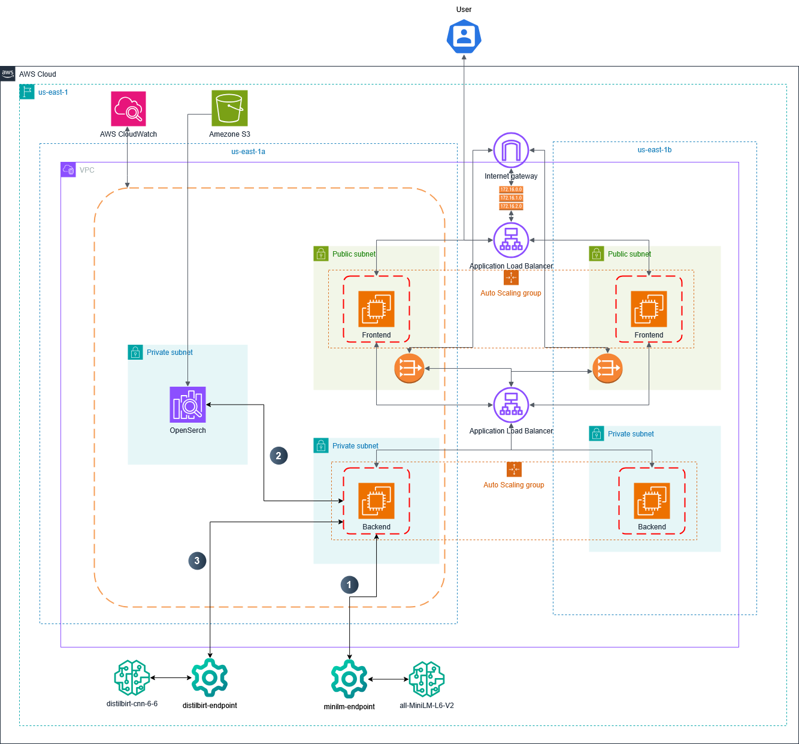

# 🧠 Recipe Generation App on AWS

[](https://aws.amazon.com/)
[](https://python.org/)
[](https://flask.palletsprojects.com/)
[](https://nginx.org/)

> **CSCI 5411 - Cloud Computing Mid-Term Project**  
> A cloud-based AI/GenAI solution for intelligent recipe suggestions using Retrieval-Augmented Generation (RAG) on Amazon Web Services (AWS).

## 📋 Table of Contents

- [Overview](#-overview)
- [Architecture](#-architecture)
- [Key Features](#-key-features)
- [AWS Services Used](#-aws-services-used)
- [How It Works](#-how-it-works)
- [Project Structure](#-project-structure)
- [Security & Optimization](#-security--optimization)
- [Cost Analysis](#-cost-analysis)
- [Deployment](#-deployment)
- [Monitoring](#-monitoring)
- [Future Improvements](#-future-improvements)
- [Contributing](#-contributing)
- [License](#-license)

## 🎯 Overview

This project demonstrates a sophisticated cloud-based recipe generation application that leverages **Retrieval-Augmented Generation (RAG)** to create personalized recipe suggestions. The system combines the power of vector databases with large language models (LLMs) to deliver contextually relevant and creative recipe recommendations based on user input.

### Key Highlights
- ✅ **Scalable Architecture**: Auto-scaling groups ensure high availability
- ✅ **AI-Powered**: Advanced NLP models for recipe generation
- ✅ **Secure Design**: VPC isolation with public/private subnet architecture
- ✅ **Cost-Optimized**: Strategic use of free-tier resources
- ✅ **Production-Ready**: Load balancers and monitoring included

## 🏗️ Architecture

The application follows a multi-tier architecture designed for security, scalability, and performance:



### Network Architecture
- **VPC**: Isolated virtual network with enhanced security
- **Multi-AZ Deployment**: 2 public and 2 private subnets across different Availability Zones
- **Load Balancing**: Separate ALBs for frontend and backend traffic management

### Compute Layer
- **Frontend**: Nginx servers (`t2.micro`) in public subnets
- **Backend**: Flask application servers (`t2.micro`) in private subnets
- **Auto Scaling**: Dynamic scaling based on demand

## ✨ Key Features

- 🤖 **AI-Powered Recipe Generation** using state-of-the-art language models
- 🔍 **Vector-Based Recipe Search** with K-Nearest Neighbors (KNN)
- 📊 **Real-time Analytics** and monitoring with CloudWatch
- 🔒 **Enterprise-Grade Security** with VPC and IAM roles
- ⚡ **High Performance** with optimized caching and load balancing
- 📱 **RESTful API** for easy integration and scalability

## 🛠️ AWS Services Used

| Service | Purpose | Configuration |
|---------|---------|---------------|
| **EC2** | Application hosting | `t2.micro` instances with Auto Scaling |
| **VPC** | Network isolation | 2 public + 2 private subnets across 2 AZs |
| **Application Load Balancer** | Traffic distribution | Frontend & Backend ALBs |
| **Auto Scaling Groups** | Dynamic scaling | Automatic instance management |
| **Amazon OpenSearch** | Vector database | Recipe index with KNN search |
| **SageMaker** | ML model hosting | 2 endpoints for embedding & generation |
| **S3** | Object storage | Snapshots and assets with encryption |
| **CloudWatch** | Monitoring & logging | Metrics and alerts |
| **IAM** | Access management | Role-based security |

### SageMaker Endpoints

1. **Text Embedding Model**
   - Model: `all-MiniLM-L6-v2`
   - Instance: `ml.t2.medium`
   - Purpose: Convert user input to 384-dimensional vectors

2. **Recipe Generation Model**
   - Model: `sshleifer/distilbart-cnn-6-6`
   - Instance: `ml.m5.xlarge`
   - Purpose: Generate creative recipes from prompts

## ⚙️ How It Works

The application follows a streamlined data flow for recipe generation:

### Detailed Process Flow

1. **User Input**: User sends HTTPS request with recipe query to Frontend ALB
2. **Request Routing**: ALB routes request to available Backend EC2 instance
3. **Text Embedding**: Backend sends user text to `all-MiniLM-L6-v2` SageMaker endpoint
4. **Vector Search**: 384-dimensional vector used to query OpenSearch recipe index
5. **Context Retrieval**: Top 5 most similar recipes retrieved using KNN search
6. **Recipe Generation**: Backend constructs detailed prompt and sends to `sshleifer/distilbart-cnn-6-6`
7. **Response Delivery**: Generated recipe with relevance scores returned as JSON

## 📁 Project Structure

```
RAG/
├── 📄 final_report.pdf  # final report
├── 🖼️ Recipe_Architecture-final.drawio.png   # Final architecture diagram
├── 🖼️ Data_sequence_final.drawio.png         # Data flow sequence diagram
└── 📄 README.md                          # This file
```

## 🔒 Security & Optimization

### Security Measures
- **VPC Isolation**: All critical resources isolated within private subnets
- **IAM Roles**: Least-privilege access with role-based permissions
- **Encryption**: S3 server-side encryption for data at rest
- **Network Security**: Security groups and NACLs for traffic control
- **Private Resources**: OpenSearch domain accessible only by backend EC2 role

### Cost Optimization Strategies
- **Free Tier Usage**: Maximized use of AWS free tier resources
- **Instance Right-sizing**: `t2.micro` instances for appropriate workloads
- **Resource Management**: Automated SageMaker endpoint lifecycle management
- **Monitoring**: CloudWatch alerts to prevent cost overruns

## 💰 Cost Analysis

| Resource | Instance Type | Estimated Monthly Cost |
|----------|---------------|----------------------|
| EC2 Instances | t2.micro (4x) | $0.00 (Free Tier) |
| Application Load Balancers | Standard (2x) | $32.40 |
| SageMaker Endpoints | ml.t2.medium + ml.m5.xlarge | $45.60 |
| OpenSearch Domain | t3.small.search | $24.48 |
| S3 Storage | Standard | $2.30 |
| CloudWatch | Standard | $10.00 |
| Data Transfer | Various | $12.02 |
| **Total Estimated Cost** | | **~$126.80/month** |

*Note: Costs based on us-east-1 region pricing and include optimization strategies*

## 🚀 Deployment

### Prerequisites
- AWS Account with appropriate permissions
- AWS CLI configured
- Python 3.8+ and pip
- Domain name (optional, for custom endpoints)

### Quick Start

1. **Clone the repository**
   ```bash
   git clone https://github.com/yourusername/recipe-generation-aws.git
   cd recipe-generation-aws
   ```

2. **Set up AWS resources**
   ```bash
   # Deploy VPC and networking
   aws cloudformation deploy --template-file infrastructure/vpc.yaml --stack-name recipe-vpc
   
   # Deploy compute resources
   aws cloudformation deploy --template-file infrastructure/compute.yaml --stack-name recipe-compute
   ```

3. **Configure SageMaker endpoints**
   ```bash
   # Deploy embedding model
   python scripts/deploy_embedding_model.py
   
   # Deploy generation model
   python scripts/deploy_generation_model.py
   ```

4. **Set up OpenSearch domain**
   ```bash
   # Create and configure OpenSearch domain
   python scripts/setup_opensearch.py
   ```

### Environment Variables

Create a `.env` file with the following variables:
```env
AWS_REGION=us-east-1
OPENSEARCH_ENDPOINT=your-opensearch-endpoint
SAGEMAKER_EMBEDDING_ENDPOINT=your-embedding-endpoint
SAGEMAKER_GENERATION_ENDPOINT=your-generation-endpoint
VPC_ID=your-vpc-id
```

## 📊 Monitoring

### CloudWatch Metrics
- **SageMaker Endpoints**: Invocation count, latency, errors
- **EC2 Instances**: CPU utilization, memory usage, network I/O
- **Load Balancers**: Request count, response time, error rates
- **OpenSearch**: Search latency, indexing rate, cluster health

### Alerts Configuration
- High CPU utilization (>80%)
- SageMaker endpoint errors
- Load balancer 5xx errors
- OpenSearch cluster status changes

### Logging
- Application logs stored in CloudWatch Logs
- VPC Flow Logs for network monitoring
- ALB access logs in S3

## 🔮 Future Improvements

### Planned Enhancements
- [ ] **Advanced LLM Integration**: Upgrade to GPT-4 or Claude for better recipe quality
- [ ] **User Authentication**: Implement user accounts with personalized recommendations
- [ ] **Recipe Rating System**: Allow users to rate and favorite recipes
- [ ] **Multi-language Support**: Expand to support international cuisines and languages
- [ ] **Mobile Application**: Develop iOS/Android apps with offline capabilities
- [ ] **Advanced Analytics**: Implement user behavior tracking and recommendation optimization
- [ ] **Containerization**: Migrate to ECS/EKS for better scalability
- [ ] **CI/CD Pipeline**: Automated testing and deployment with CodePipeline

### Technical Debt
- [ ] **Error Handling**: Implement comprehensive error handling and retry logic
- [ ] **Caching Layer**: Add Redis/ElastiCache for improved performance
- [ ] **Database Migration**: Consider RDS for structured data storage
- [ ] **API Versioning**: Implement proper API versioning strategy

## 📄 License

This project is part of CSCI 5411 coursework and is intended for educational purposes.

## 📞 Contact

**Student**: [Your Name]  
**Student ID**: B01024200  
**Course**: CSCI 5411 - Cloud Computing  
**Institution**: [Your University]

---

<div align="center">
  <strong>Built with ❤️ using AWS Cloud Services</strong>
</div>
